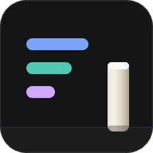
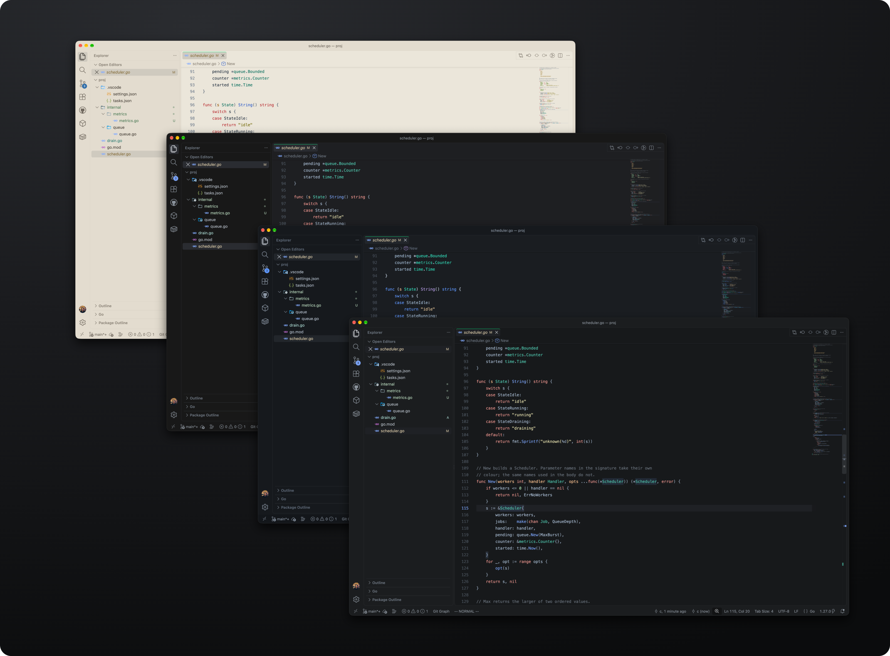
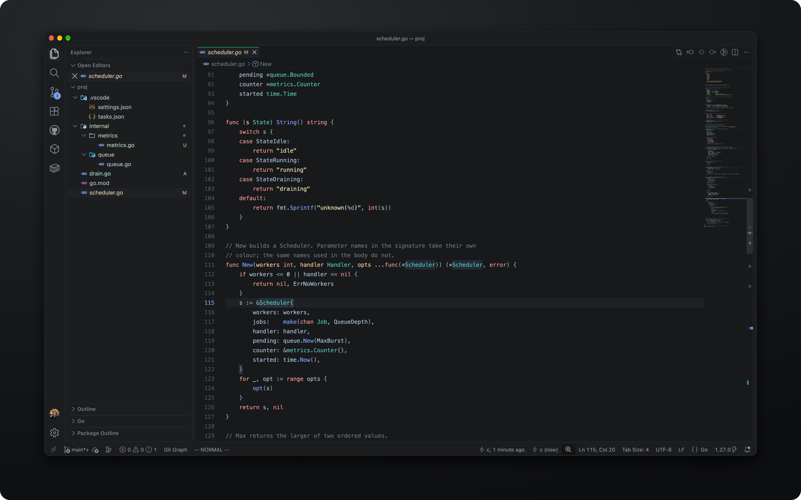
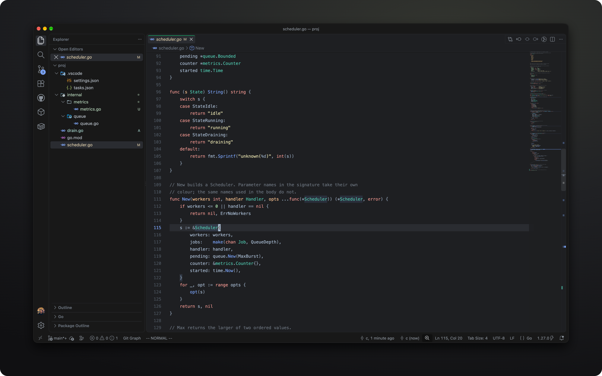
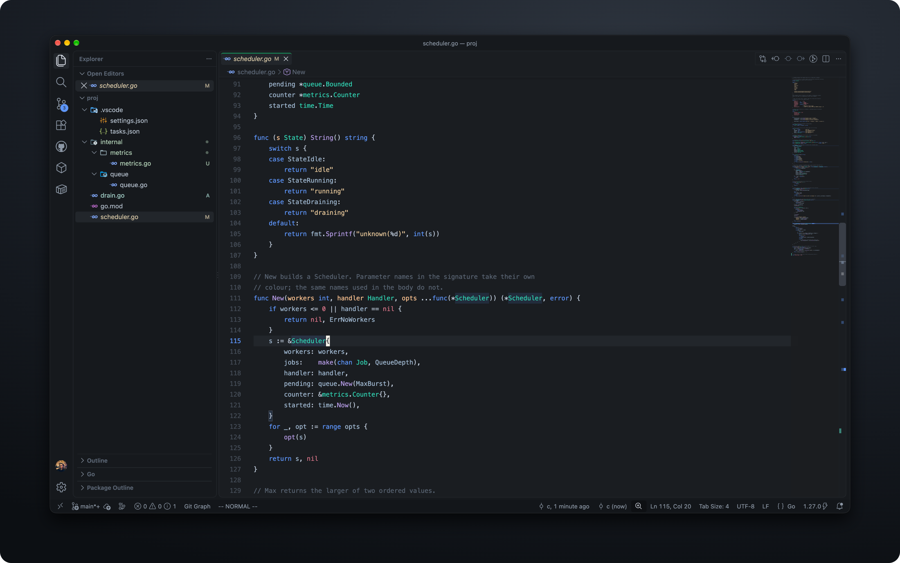
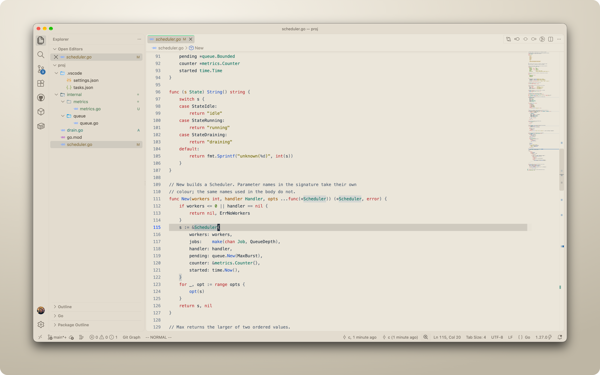

<div align="center">



# Chalkdraw

**A chalkboard-inspired theme in four variants — three dark, one light — designed to minimize eye strain**

[](https://marketplace.visualstudio.com/items?itemName=michaelvolakis.chalkdraw)
[](https://marketplace.visualstudio.com/items?itemName=michaelvolakis.chalkdraw)
[](https://marketplace.visualstudio.com/items?itemName=michaelvolakis.chalkdraw)
[](./LICENSE)

</div>

<br />



<br />

## Install

Open Quick Open (`Ctrl+P` / `Cmd+P`), then run:

```
ext install michaelvolakis.chalkdraw
```

Then pick the theme: **Preferences: Color Theme** → **Chalkdraw Deep**, **Chalkdraw Flat**, **Chalkdraw Cool** or **Chalkdraw Paper**.

<br />

## Neovim

The same four variants ship as a Neovim colorscheme, generated from the same palette source, so the two editors never drift apart. Requires Neovim 0.9+ with `termguicolors`.

**lazy.nvim**

```lua
{
  'mihavo/chalkdraw',
  lazy = false,
  priority = 1000,
  config = function()
    vim.cmd.colorscheme('chalkdraw-deep')
  end,
}
```

**packer**

```lua
use { 'mihavo/chalkdraw', config = function() vim.cmd.colorscheme('chalkdraw-deep') end }
```

**Transparent background**

```lua
{
  'mihavo/chalkdraw',
  lazy = false,
  priority = 1000,
  config = function()
    require('chalkdraw').setup({ variant = 'deep', transparent = true })
  end,
}
```

Clears the backgrounds that sit on the terminal — editor, sign column, status line, tab line, file trees — so your terminal's own background shows through. Floats, popups, the completion menu, the cursor line and selections keep theirs, since a transparent popup over arbitrary content is unreadable. The setting survives a later `:colorscheme chalkdraw-flat`. If you only ever use `:colorscheme`, set `vim.g.chalkdraw_transparent = true` before it instead.

Pick a variant with `chalkdraw-deep`, `chalkdraw-flat`, `chalkdraw-cool` or `chalkdraw-paper`. Treesitter, LSP semantic tokens, diagnostics, git signs and the 16 ANSI terminal colors are all covered, along with Telescope, nvim-tree, neo-tree, nvim-cmp, blink.cmp, which-key, indent guides, notify/noice, mini.nvim, lazy and mason.

<br />

## Variants

| Theme | Editor | Panels | Notes |
| --- | --- | --- | --- |
| **Chalkdraw Deep** | `#17191b` | `#1b1d1f` | Editor is the darkest surface |
| **Chalkdraw Flat** | `#1e1f22` | `#181818` | Panels recede behind a lighter editor |
| **Chalkdraw Paper** | `#ebe6da` | `#e2dcce` | Warm uncoated stock, never white |
| **Chalkdraw Cool** | `#1a1d21` | `#16191d` | Faint blue cast, panels darker than the editor |

<br />

## Screenshots

**Deep**



**Flat**



**Cool**



**Paper**



<br />

## Chalkdraw Cool

A near-neutral dark ground with a faint blue cast, where the panels sit one step *darker* than the editor rather than lighter — the inverse of Deep and Flat. The chrome is deliberately darker than Deep and Flat, and syntax runs at roughly 140% of Deep's chroma, so the colours carry further against the cooler ground: keyword blue and type teal do the structural work, functions are violet, and strings are the only warm note in the code. Identifiers stay a bright warm-neutral chalk white, which is what keeps it recognisably Chalkdraw.

**UI**

| Role | Hex |
| --- | --- |
| Editor background | `#1a1d21` |
| Sidebar, tabs, title bar, terminal | `#16191d` |
| Status bar | `#13161a` |
| Dividers and tab borders | `#25292e` |
| Active selection | `#22262b` on `#e4eaf3` |
| Active tab | `#1a1d21`, top border `#5e97ff` |
| Inactive tab text | `#8c97a5` |
| Foreground | `#e4eaf3` |
| Description text | `#8c97a5` |
| Section labels, inactive panel tabs | `#5f6a79` |
| Accent — links, cursor, focus, indicators | `#5e97ff` |
| Link hover | `#96bcff` |
| Tree files | `#b4bfcc` |
| Tree secondary | `#8c97a5` |
| Tree ignored | `#4e5460` |

**Syntax**

| Role | Hex |
| --- | --- |
| Default foreground | `#f2f0e8` |
| Keywords | `#5e97ff` |
| Types, packages, classes | `#2fd8b6` |
| Functions and methods | `#b79ce8` |
| Fields, properties, variables | `#a4bdd6` |
| Parameter names | `#ffc491` |
| Strings | `#e8c79a` |
| Numbers, constants, `nil`/`true`/`false` | `#e4798d` |
| Comments | `#5b6675` |
| Punctuation and operators | `#c3cfdf` |
| Line numbers | `#464e59` |

Cool reuses the shared git decoration scale unchanged, and is the one variant where fields and properties take a colour of their own rather than the default foreground.

<br />

## Palette

| Role | Dark | Paper |
| --- | --- | --- |
| Keywords, storage, control flow | `#f29790` | `#b7272d` |
| Imported module paths | `#ffd084` | `#885e00` |
| Types, classes, packages | `#4fc9b0` | `#006d5c` |
| Functions and methods | `#7aa2f7` | `#2c59c8` |
| Strings | `#ede7b2` | `#726700` |
| Numbers, constants | `#a0d6a6` | `#376d00` |
| Variables, fields, properties | `#abbfd6` | `#202e3e` |
| Parameter names in declarations | `#ffc491` | `#985500` |
| Operators, brackets, separators | `#93a4b8` | `#576474` |
| Comments | `#6d7681` | `#4e5d6f` |
| Line numbers | `#4b545e` | `#798593` |
| Cursor | `#abbfd6` | `#202e3e` |
| Rails, active marks | `#7aa2f7` | `#2e6da8` |
| Editor background | `#17191b` | `#ebe6da` |
| Sidebar, tabs, status bar | `#1b1d1f` | `#e2dcce` |
| Active line | `#1f2125` | `#cfcabf` |
| Dividers | `#282a2d` | `#d9d3c7` |

<br />

## Recommended settings

The screenshots above use these settings:

```jsonc
{
  "workbench.colorTheme": "Chalkdraw Deep",
  "editor.fontFamily": "JetBrains Mono, monospace",
  "editor.fontLigatures": false,
  "editor.fontSize": 13,
  "editor.lineHeight": 22,
  "editor.tabSize": 4,
  "editor.renderWhitespace": "selection"
}
```
